# Tron Legacy CV: the Grid in your webcam, controlled with your hands

<p align="center">
  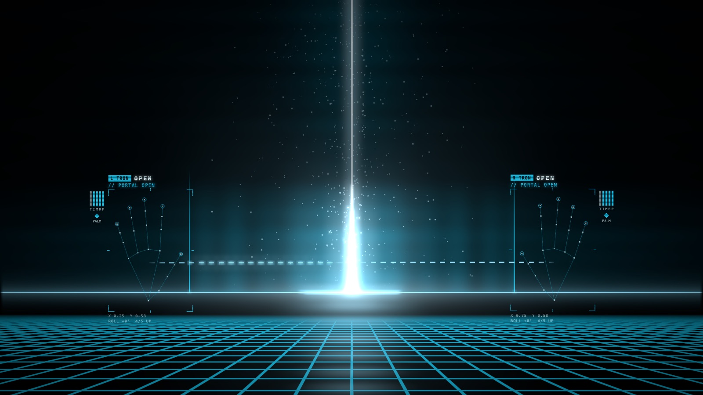
</p>

I love TRON: Legacy. The Grid, the light cycles, the identity discs, the Daft Punk soundtrack: I've rewatched
it more times than I'd like to admit, and I always wanted to throw an identity disc myself. So I built the
next best thing. **Tron Legacy CV** turns your webcam into the Grid: you draw glass light walls with your
finger, summon a disc and throw it so it ricochets off the walls you drew, pull a baton apart into a light
cycle, get digitized by the laser and shut the whole Grid down with two fists, all with hand gestures, live
in the browser.

It's a computer vision project at heart: MediaPipe tracks 21 landmarks on each hand, and everything you see is
driven by a gesture recognizer I built on top of those landmarks. It runs entirely in your browser. Nothing
is uploaded anywhere.

**▶ Live demo:** https://tron-legacy-cv.vercel.app (allow the camera, or watch the scripted demo without one)

- **Nine gestures, two hands**: point, rock, OK (and a flick to throw), thumbs up, a held fist, two fists
  together, peace, shaka and both open palms. Each hand plays independently and has its own team colour,
  TRON cyan or CLU orange.
- **Finger-level gesture recognition**: per-finger joint angles, thumb-to-fingertip contacts with
  hysteresis, palm orientation and handedness, all measured relative to palm size, so it works at any
  distance from the camera.
- **Gestures that are hard to trigger by accident**: destructive ones have to be held, with a charging ring,
  so passing through a fist while changing gestures doesn't erase anything.
- **Person segmentation**: the digitizing laser finds your silhouette with MediaPipe's selfie segmenter and
  turns *you* into light.
- **Physics you can play with**: discs ricochet off the walls you drew, off batons and off each other.
- **Live tuning panel** (press `G`): every threshold of the recognizer on a slider, with the raw
  measurements of each finger and the tracker's pace next to it.
- **Works without a camera**: a scripted demo runs through every gesture with procedural hands that go
  through the exact same recognition pipeline.

## What you can do

| Gesture | What happens |
| --- | --- |
| ☝️ **Point** (index finger only) | Draws a glass light wall behind your fingertip, like a light cycle: straight runs and 90° turns |
| 🤘 **Rock** (index + pinky) | Switches that hand's colour between TRON cyan and CLU orange |
| 👌 **OK** | Summons an identity disc into that hand |
| **Flick** while holding a disc | Throws it. It ricochets off the screen edges, your walls, batons and the other disc, then comes back |
| 👍 **Thumbs up** | Rezzes a light cycle that drops onto the Grid and rides off, leaving its own glass wall |
| ✊ **Hold a fist** | A ring charges for half a second, then everything around that hand derezzes into voxels |
| ✊✊ **Two fists together** | END OF LINE: the whole Grid derezzes and shuts down, then reboots |
| ✌️ **Peace** | The digitizing laser sweeps over you and turns your outline into light |
| 🤙 **Shaka** (thumb + pinky) | A light baton in your hand: swing it to cut walls and bat discs away. Grab its other end with your other hand and pull apart, and it splits into two handles and rezzes a light cycle |
| 🖐️🖐️ **Both palms open**, facing the camera | Opens a portal of light between your hands and lights up the Grid |

<table>
  <tr>
    <td width="50%">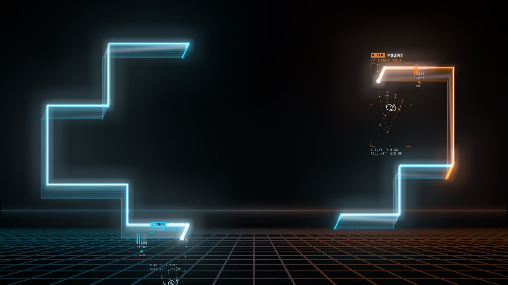<br><b>Point:</b> glass light walls, and <b>rock</b> switching the right hand to CLU orange</td>
    <td width="50%">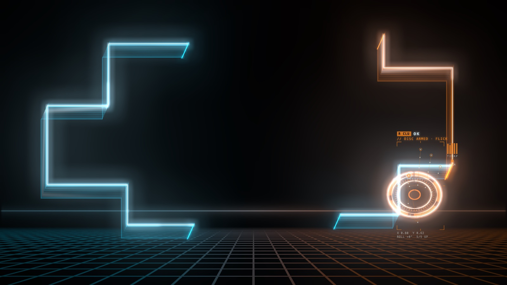<br><b>OK:</b> an identity disc, ready to throw</td>
  </tr>
  <tr>
    <td>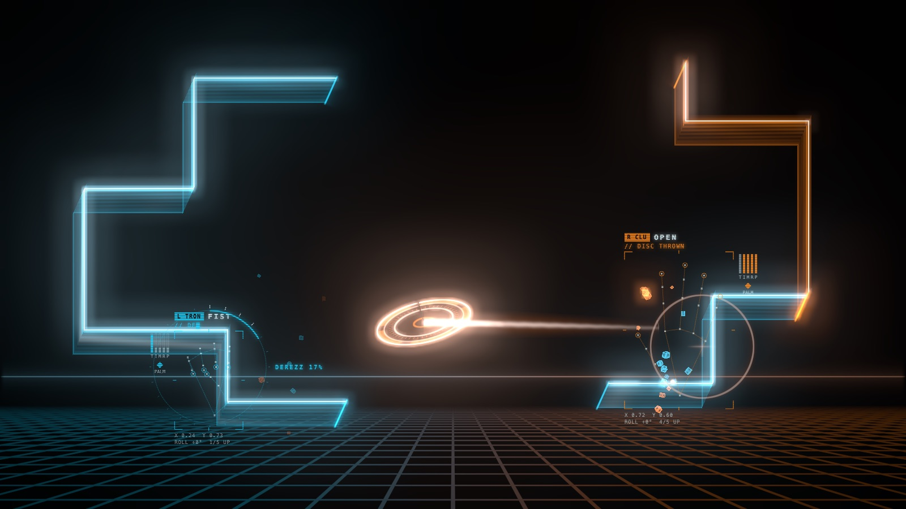<br><b>Flick:</b> the disc ricochets off the walls I drew</td>
    <td>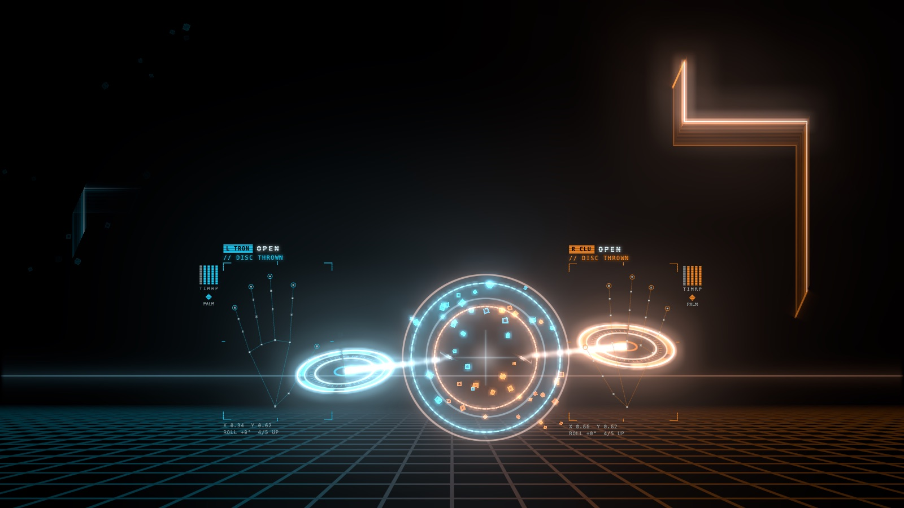<br>Two discs, two colours, one collision</td>
  </tr>
  <tr>
    <td>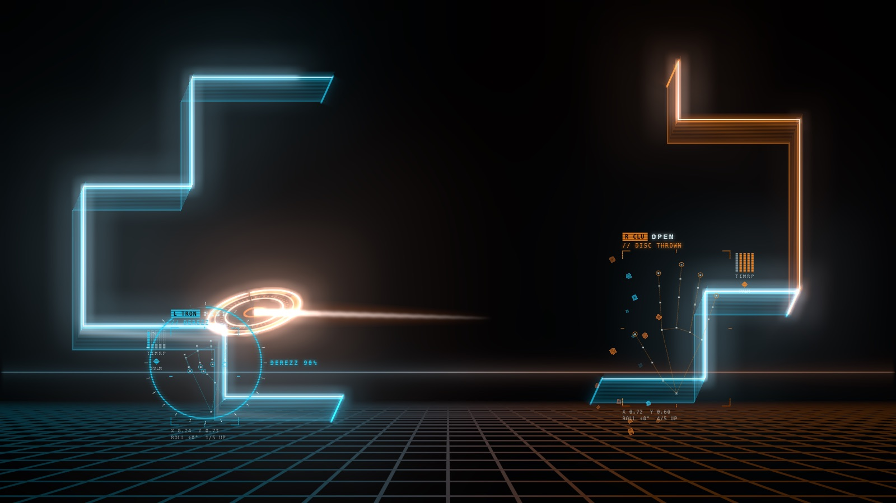<br><b>Hold a fist:</b> a local derezz</td>
    <td>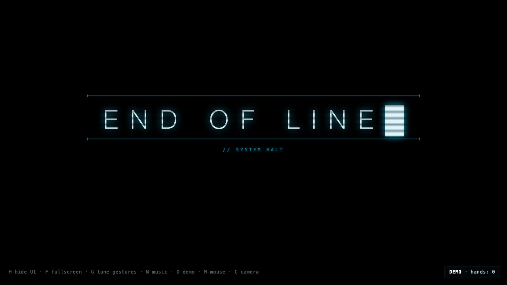<br><b>Two fists:</b> END OF LINE</td>
  </tr>
  <tr>
    <td>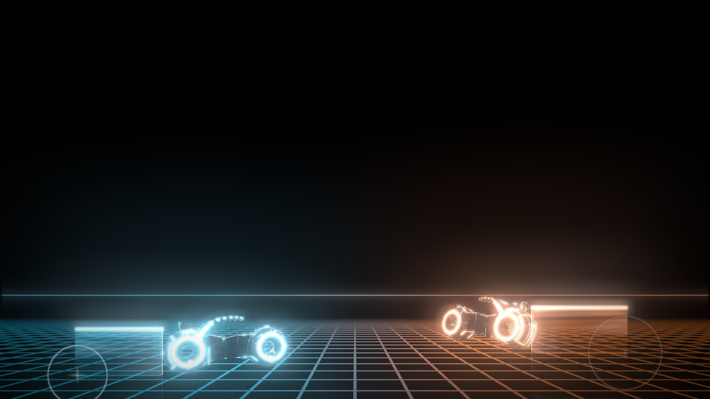<br><b>Thumbs up:</b> light cycles on the Grid</td>
    <td>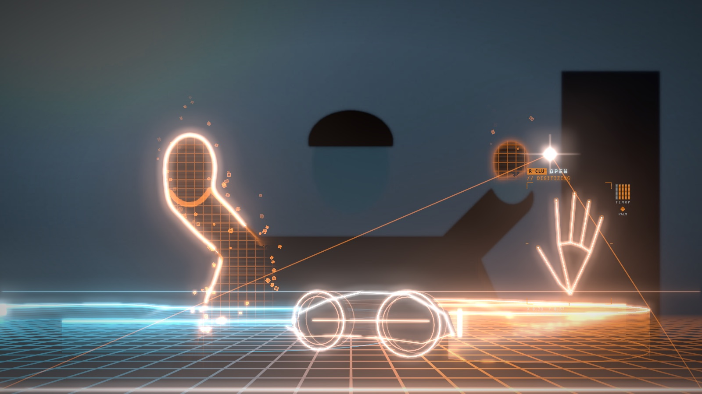<br><b>Peace:</b> the digitizing laser (here on a synthetic test video)</td>
  </tr>
  <tr>
    <td>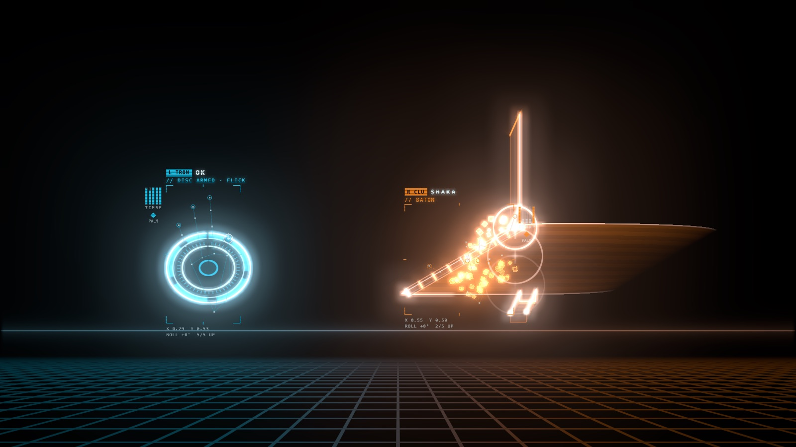<br><b>Shaka:</b> a light baton cutting through a wall</td>
    <td>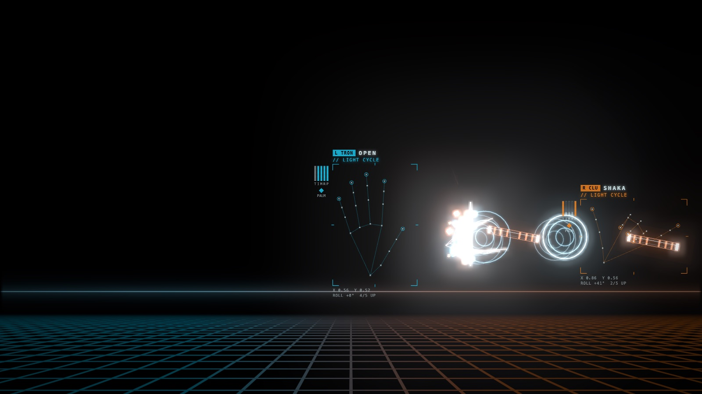<br>Grab the other end and pull: the baton splits</td>
  </tr>
  <tr>
    <td>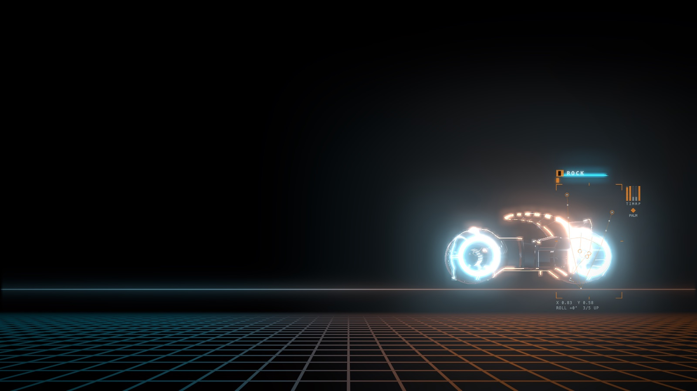<br>…and a light cycle rezzes between your hands</td>
    <td>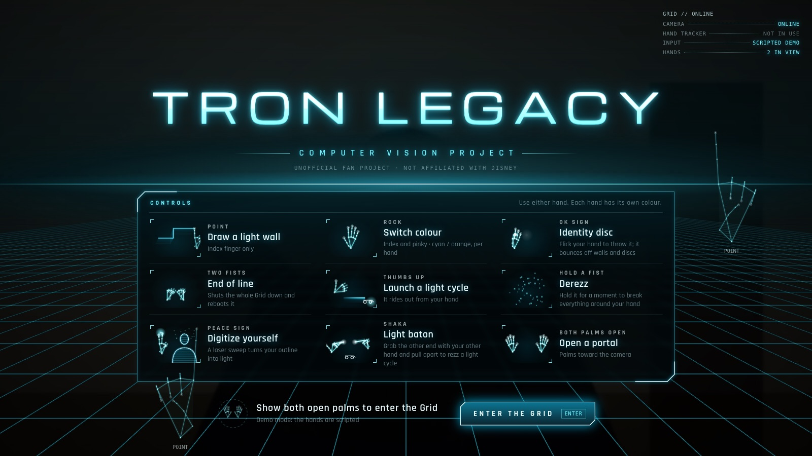<br>The intro, with the controls</td>
  </tr>
</table>

## How it works

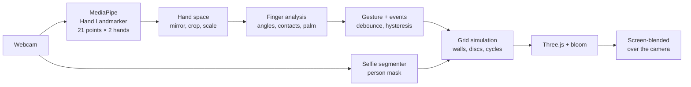

1. **Tracking** (`src/hands.js`): MediaPipe's Hand Landmarker runs on every new webcam frame (GPU delegate, CPU
   fallback) and returns 21 landmarks per hand. Loading the model and warming up its shaders freezes the page for
   over half a second, so the intro holds a still screen until the first detection is done. A Web Worker version
   (`src/tracker-worker.js`, `?tracker=worker`) keeps even that off the main thread, but in Chrome the copied
   frames made tracking drop hands that were in plain view, so it's opt-in. A hand also survives a few missed
   frames (the window stretches with the tracker's actual pace) instead of blinking out and re-firing its gesture.
2. **Hand space**: the landmarks are mirrored to match the selfie view, mapped through the `object-fit: cover`
   crop of the full-screen video, and scaled so x, y and z share one unit. Every measurement is then divided
   by the palm length (wrist to middle knuckle), so a gesture reads the same close to the camera and far from it.
3. **Finger state** (`src/gestures.js`): a finger is extended when its bones line up: the mean cosine between
   consecutive bones (wrist → knuckle → joints → tip) is above a threshold *and* the tip is farther from the
   wrist than the middle joint. The thumb also has to stick out away from the index knuckle.
4. **Contacts**: the distance from the thumb tip to each fingertip, in palm lengths, with hysteresis (touching
   below 0.30, released above 0.45), so taps don't flicker.
5. **Fist vs. pinch**: in a fist the thumb rests on the index finger exactly like in a pinch. The difference is
   that a fist folds the index tip back towards the wrist, so a pinch only counts when the index isn't folded.
6. **Palm orientation and handedness**: the palm normal comes from the cross product of the wrist → index knuckle
   and wrist → pinky knuckle vectors. A left palm and the back of a right hand are mirror images, so the sign
   only means something once you know which hand it is. With two hands in view, the left one on screen is the
   left hand, and those frames also teach the app whether MediaPipe's own handedness labels need swapping.
7. **Gestures and events**: the classified gesture has to hold for 90 ms before it takes over, and the app emits
   one-frame events (gesture changed, thumb tap, pinch closed/opened) that the effects react to. On top of that,
   each action has its own timing: a fist only derezzes after being held for half a second (you pass through a
   fist all the time when switching gestures), END OF LINE needs both fists close together, and the baton only
   splits once the second hand has grabbed its end and the hands have pulled apart past a threshold.
8. **Segmentation**: for the digitizing laser, MediaPipe's selfie segmenter produces a person mask, but only while
   the effect runs. A shader turns the mask's edge into the glowing outline.
9. **Rendering**: Three.js draws everything on black with bloom, and the layer is composited over the camera with
   `mix-blend-mode: screen`, so light adds onto the room and black stays see-through.

### Tuning

Press `G` for the tuning panel. For each hand it shows how straight every finger is, how far the thumb is from
each fingertip and which way the palm faces, next to the thresholds they're compared with. The sliders change
the thresholds live and are remembered in the browser; **Copy as code** puts the values on the clipboard ready
to paste into `src/gestures.js`. It's what I use to tune the recognition on my own hands.

## Run it locally

It's plain HTML and JavaScript modules with no build step. The camera only works over `http://localhost` or
`https`, so serve the folder instead of opening the file:

```bash
git clone https://github.com/ondrej-cloud/tron-legacy-cv.git
cd tron-legacy-cv
python3 -m http.server 8650
# open http://localhost:8650 in Chrome or Safari
```

On macOS you can also double-click `Start.command`.

| Key | Action |
| --- | --- |
| `F` | fullscreen |
| `H` | hide the UI |
| `G` | gesture tuning panel |
| `D` | scripted demo on/off |
| `M` / `C` | mouse / camera input |

URL options: `?skipintro`, `?demo`, `?tune`, `?clean` (start with the UI hidden), `?tracker=worker`.

### Tests and screenshots

```bash
npm install
npm test                 # gesture recognition checks against procedural hands
npm run shot -- ./ --query "demo=1&skipintro"   # headless screenshots with a fake webcam
```

`npm test` runs every pose of the procedural hand through the recognizer for both hands, palm in and out and
tilted (727 checks). The screenshot tool drives headless Chrome on the real GPU with a fake webcam; all the
pictures in this README come from it.

## Project structure

```
index.html              page, import map, layers (camera, effect, UI)
src/
  main.js               host: camera background, effect loop, intro
  hands.js              tracking, hand space, handedness, events, demo/mouse input
  tracker-worker.js     the same tracker in a Web Worker (opt-in, ?tracker=worker)
  gestures.js           finger analysis, gesture classifier, thresholds, procedural hand
  segmentation.js       selfie segmentation for the digitizing laser
  tuning.js             live tuning panel (G)
  ui.js                 status and keyboard shortcuts
  intro*.js, intro.css  camera gate, boot sequence, controls, entering the Grid
  effects/tron/         glass walls, discs, baton, cycles, voxels, portal, Grid, HUD, digitize,
                        END OF LINE, demo
tools/
  test-gestures.mjs     recognition tests
  shot.mjs              headless screenshots
media/                  README images
```

## How it was made

I came up with the effects and how they should behave myself; for the harder parts (the shader math, the
physics and most of the rendering code) I used AI. The computer vision side is where I spent my own time:
designing the gesture set, testing it on my hands and tuning how each gesture is recognised from the 21
landmarks until it felt reliable.

Built with [Three.js](https://threejs.org) and [MediaPipe](https://ai.google.dev/edge/mediapipe/solutions/guide)
(Hand Landmarker and Image Segmenter).

*This is an unofficial fan project. TRON and TRON: Legacy are trademarks of Disney; this project isn't
affiliated with or endorsed by Disney.*
